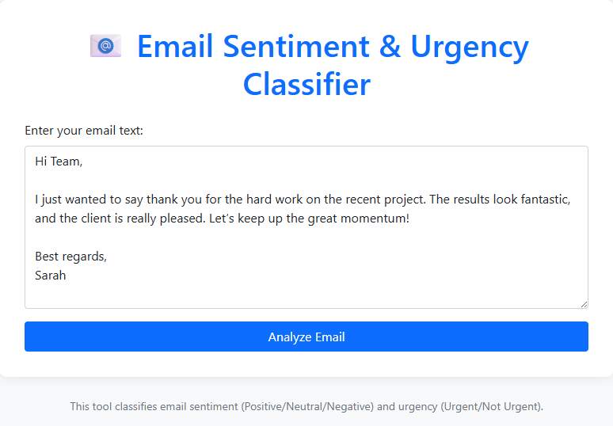
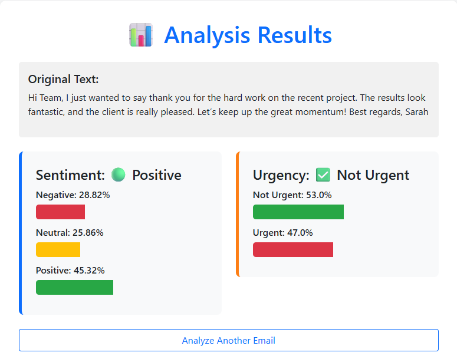
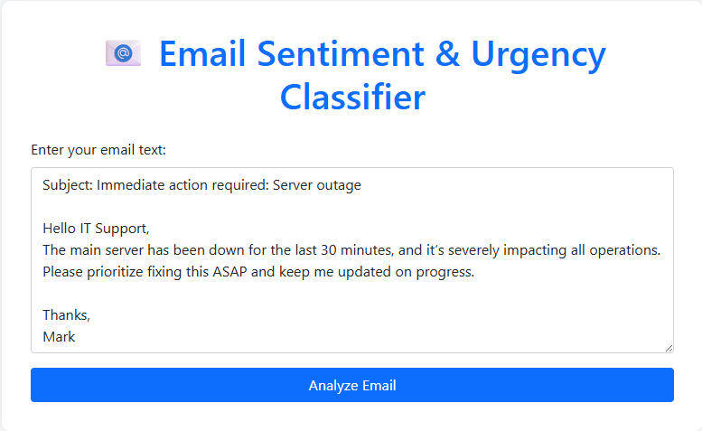
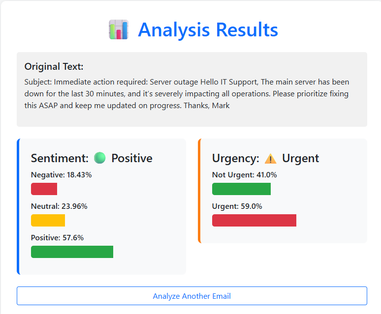
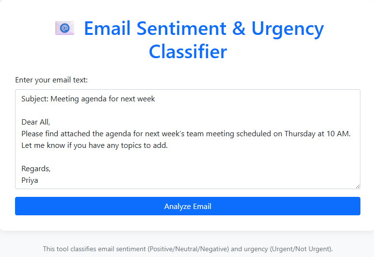
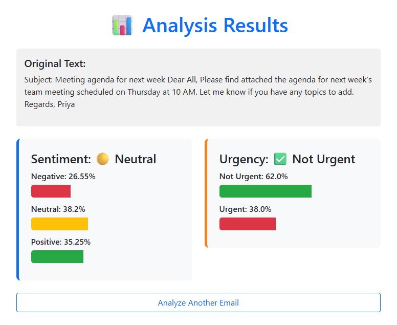

# Email Sentiment & Urgency Classifier

A powerful machine learning system that automatically classifies email **sentiment** (Positive / Neutral / Negative) and **urgency** (Urgent / Not Urgent). Designed to streamline email management by prioritizing messages based on tone and time-sensitivity. The model can also be seamlessly integrated with virtual keyboard apps or other messaging platforms for real-time analysis.

---

## Features

- **Sentiment Prediction:**  
  🔴 Negative | 🟡 Neutral | 🟢 Positive — understand the emotional tone of emails  
- **Urgency Prediction:**  
  ⚠️ Urgent | ✅ Not Urgent — identify time-critical messages  
- **Probability Scores:**  
  Get confidence probabilities for each predicted class to help with decision thresholds  
- **Web Interface:**  
  Easy-to-use Flask-based frontend for quick testing and demonstration  
- **REST API Endpoint:**  
  Integrate the classifier into your applications or services with a simple HTTP API  

---
## 🖼️ UI Preview

  
  
  
  
 
  


---

## Installation

Follow these steps to get the project up and running locally:

1. **Clone the repository:**

   ```bash
   git clone https://github.com/tanushkapatil/Email_Sentiment_Analysis.git
